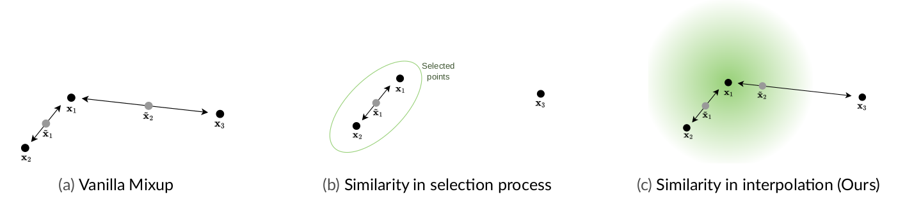
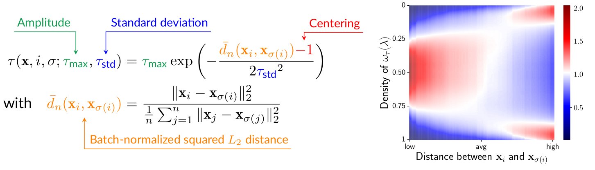
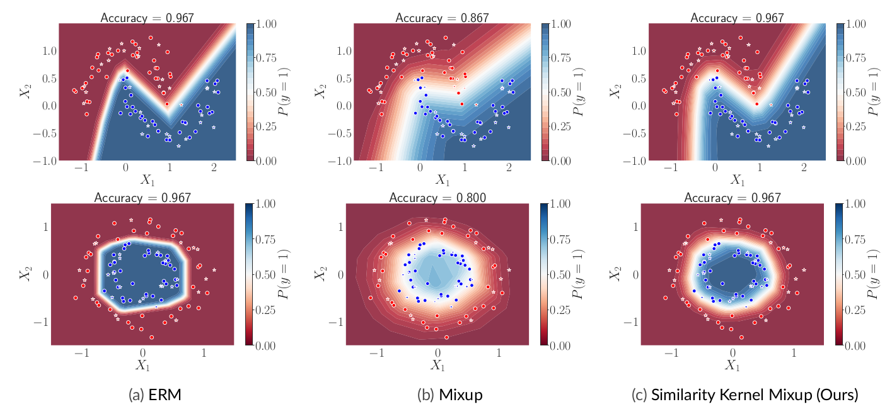

# Tailoring Mixup to Data for Calibration

Official code for *Similarity Kernel Mixup* on classification tasks (see `classification` folder), and regression tasks (see `regression` folder). Each folder contains a separated README for information about setting up and running experiments. Code to reproduce experiments on toy dataset is included in the `toy_datasets` folder.

## Taking into account similarity in Mixup



Introducing similarity into the interpolation is more efficient and provides more diversity than explicitly selecting the points to mix.

## Similarity Kernel

**Batch-normalized and centered Gaussian kernel**



- Amplitude $\tau_{max}$ governs the strength of the interpolation
- Standard deviation $\tau_{std}$ governs the extent of mixing
- Stronger interpolation between similar points and reduce interpolation otherwise

## Avoiding Manifold Intrusion



## Reference

If you find this work interesting, or if this repository has been helpful to you, please consider citing our work as follows:

```
@article{bouniot2023tailoring,
  title={Tailoring Mixup to Data for Calibration},
  author={Bouniot, Quentin and Mozharovskyi, Pavlo and d'Alch{\'e}-Buc, Florence},
  journal={arXiv preprint arXiv:2311.01434},
  year={2023}
}
```
